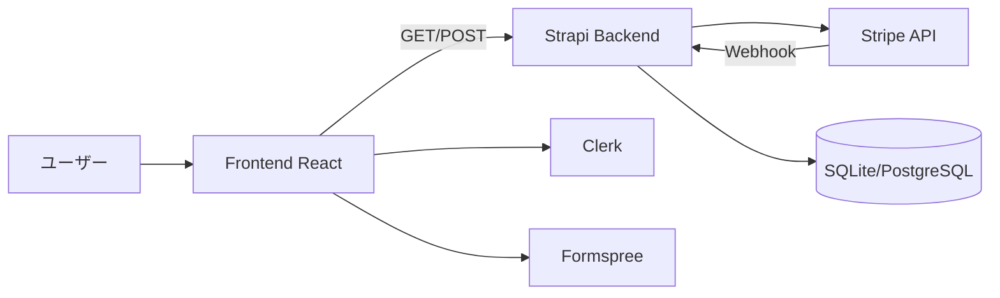

# 基本設計書

- 更新日: 2026-04-10
- 対象: アーキテクト / 実装者 / 運用者
- 目的: システム全体構成と責務分担を示す
- 前提: frontend + Strapi + 外部SaaS連携
- 関連ドキュメント: [詳細設計書](../04_detailed-design/detailed-design.md), [API設計書](../05_api/api-specification.md)

## 1. システム全体構成

## 2. 各アプリの責務

- Frontend: 画面表示、導線制御、入力検証、外部API呼び出し
- Backend: CMSコンテンツ公開、決済関連API、webhook受信
- Strapi管理画面: 運用者による公開/非公開管理

## 3. 主要ページ構成

- Main: Home, Works, News, Blog, Events, Contact, FAQ, Legal
- Store: Home, Products, ProductDetail, Cart, Guide, Legal
- Fanclub: HomeHub, Join/Login, MyPage, Movies, Gallery, Tickets

## 4. 主要導線

- Home → Store/Fanclub へサブドメイン導線
- Contact: タブで問い合わせ / 依頼を切替
- Checkout: Frontend → Backend payments API → Stripe hosted page

## 5. 認証 / 権限

- Clerkキーあり: `useCurrentUser` でユーザー解決
- Clerkキーなし: ゲスト固定で安全側制御
- `FanclubAuthGuard`: ログイン / メール認証 / 契約状態を段階判定
- `ContentAccessGuard`: `accessStatus` + 期限 + role 判定

## 6. 多言語・テーマ

- i18next + LanguageDetector（localStorage優先）
- ThemeProvider（localStorage + system判定）

## 7. 外部連携一覧

- Clerk: 認証
- Formspree: フォーム送信
- Stripe: checkout / portal / webhook
