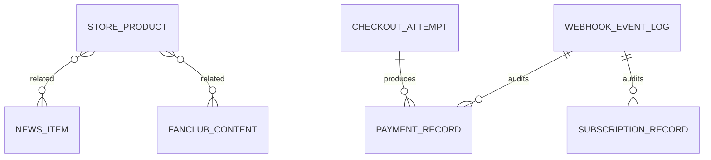

# DB設計書

- 更新日: 2026-04-10
- 対象: Strapi Content Types / DB
- 目的: モデルの役割、主要カラム、relation、公開状態を説明
- 前提: 開発SQLite / 本番PostgreSQL
- 関連ドキュメント: [CMS運用マニュアル](../09_operations/cms-manual.md)

## 1. DB全体概要

- Strapi の `schema.json` が論理モデル定義
- `draftAndPublish=true` により公開管理列が付与
- 主要共通属性: `title`, `slug`, `publishAt`, `limitedEndAt`, `archiveVisibleForFC`, `accessStatus`

## 2. 主要モデル一覧

| モデル | 用途 | 主な状態列 |
|---|---|---|
| `work` | 作品 | `featured`, `pickup`, `accessStatus` |
| `news-item` | お知らせ | `sortOrder`, `accessStatus` |
| `blog-post` | ブログ | `category`, `accessStatus` |
| `event` | イベント | `startAt`, `endAt`, `accessStatus` |
| `fanclub-content` | FC投稿 | `category`, `accessStatus` |
| `store-product` | 商品 | `price`, `stock`, `purchaseStatus`, `isPurchasable` |
| `membership-plan` | FC課金プラン | `isJoinable`, `stripePriceId` |
| `checkout-attempt` | 決済開始ログ | `checkoutType`, `status`, `idempotencyKey` |
| `payment-record` | 決済結果 | `paymentStatus`, `amountTotal`, `currency` |
| `subscription-record` | 課金契約履歴 | `subscriptionStatus`, `membershipType` |
| `webhook-event-log` | webhook監査 | `eventId`, `eventType`, `status` |

## 3. 公開状態/表示状態の整理

- `accessStatus=public`: 全員表示
- `accessStatus=fc_only`: 会員のみ表示
- `accessStatus=limited`: 期限内全員、期限後は `archiveVisibleForFC` で分岐

## 4. relation 例

- `store-product.relatedNews` → `news-item` (manyToMany)
- `store-product.relatedFanclubContents` → `fanclub-content` (manyToMany)
- `fanclub-content.relatedProducts` → `store-product` (manyToMany)

## 5. データライフサイクル（例: Store）

1. CMSで商品登録（draft）
2. publish して公開
3. checkout開始時に `checkout-attempt` 作成
4. webhookで `payment-record` / `subscription-record` 更新

## 6. ER図（概念）

