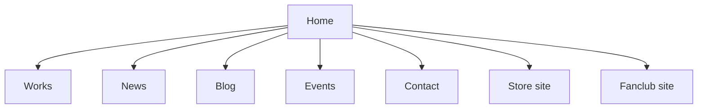
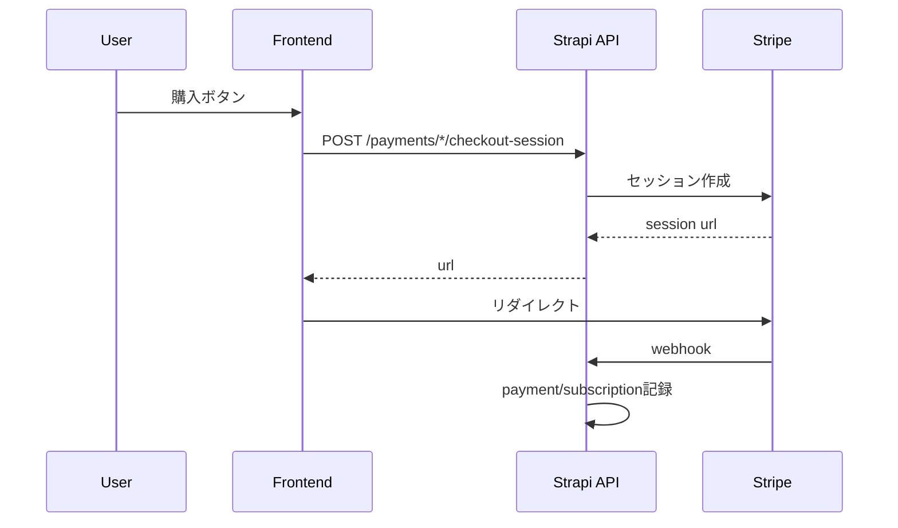

# アーキテクチャ図集

- 更新日: 2026-04-10
- 対象: 設計把握
- 目的: 文章だけでは把握しづらい依存関係を図示
- 前提: Mermaid表示対応環境
- 関連ドキュメント: [basic-design](../03_basic-design/basic-design.md)

## 1. 画面遷移（簡略）

## 2. データフロー（Checkout）

## 3. 権限マトリクス（簡略）

| ロール | public | fc_only | limited(期限内) | limited(期限後+archiveVisibleForFC) |
|---|---:|---:|---:|---:|
| guest | ✅ | ❌ | ✅ | ❌ |
| member/premium/admin | ✅ | ✅ | ✅ | ✅ |
